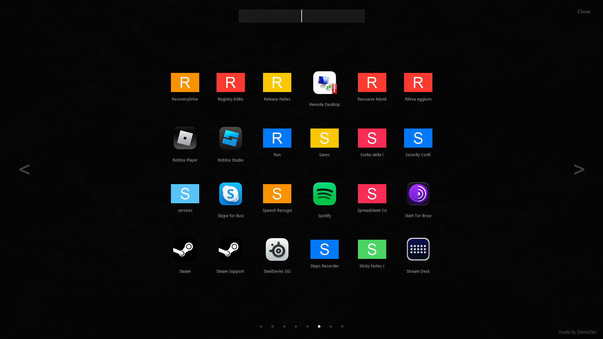

# 🚀 WinLaunchpad

**WinLaunchpad** is an elegant, lightweight, and fluid clone of the famous macOS "Launchpad", natively redesigned for Windows. Developed in Python using Tkinter, it provides a full-screen interface to quickly access all your programs, games, and files while keeping your desktop clean.



## ✨ Key Features

* **⚡ Global Quick Access:** Press `ALT + Q` at any time to instantly show or hide the Launchpad.
* **🔍 Smart Search:** A responsive search bar allows you to find your applications simply by typing their name.
* **📄 Smooth Pagination:** Navigate through your app pages using the on-screen buttons or mouse wheel.
* **🎨 Customizable Icons:** Built-in support for `.png`, `.jpg`, or `.icns` icons placed in the `icons/` folder.
* **🪟 Immersive Style:** Full-screen design with a dark background for a modern look.

---

## 📥 Installation Options

You can run **WinLaunchpad** in two different ways depending on your preferences:

### 1. Ready-to-Use Windows Installer (Recommended)
You do not need Python or any dependencies installed. Simply download the standalone setup installer:
* 🌐 **Official Web Page:** [denisdev.online/projects/launcher/index.html](https://denisdev.online/projects/launcher/index.html)
* 💾 **Direct Installer Download:** [WinLaunchpad_Setup_v1.0.exe](https://denisdev.altervista.org/WinLaunchpad_Setup_v1.0.exe)

### 2. Python Source Code (`launchpad.pyw`)
If you want to run the application directly from the source code:

1. **Clone the Repository**
   ```bash
   git clone https://github.com/YOUR-USERNAME/WinLaunchpad.git
   cd WinLaunchpad
   ```

2. **Install Dependencies**
   ```bash
   pip install Pillow
   ```

3. **Run the Application**
   ```bash
   python launchpad.pyw
   ```

---

## 📁 Customizing Icons (`icons/` folder)

For your apps to display custom logos:
1. Place your `.png`, `.jpg`, or `.icns` files inside the `icons/` folder located in the program directory.
2. Name the image file after the application (in lowercase).
   * *Example:* For "Google Chrome", name the file `google chrome.png` or `chrome.png`.

---

## 💻 Usage

* **Show / Hide:** Press `ALT + Q` on your keyboard.
* **Exit App:** Press `ESC` or click "Close" in the top right corner.
* **Scroll Pages:** Use the mouse wheel or click the `<` and `>` arrows.

---

## 👨‍💻 Author

Developed with ❤️ by **DenisDev**.
